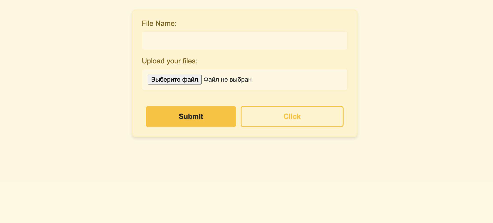
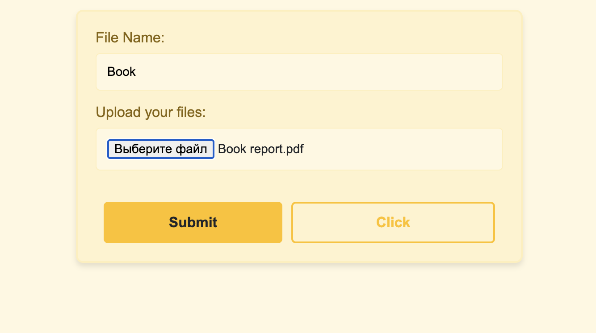
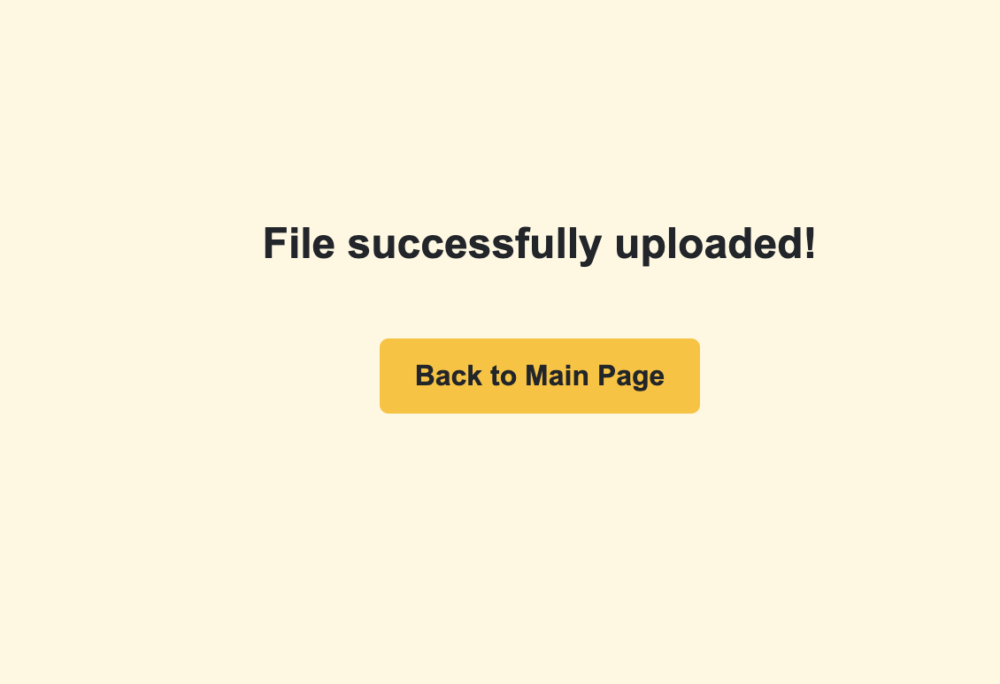
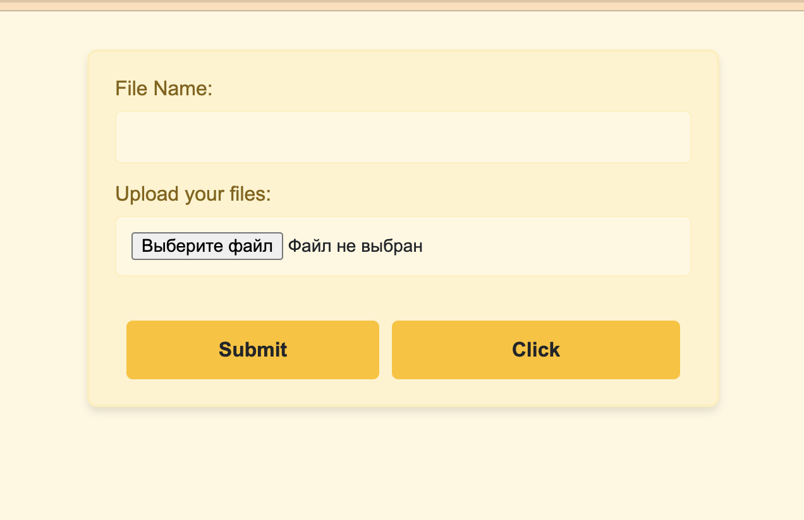
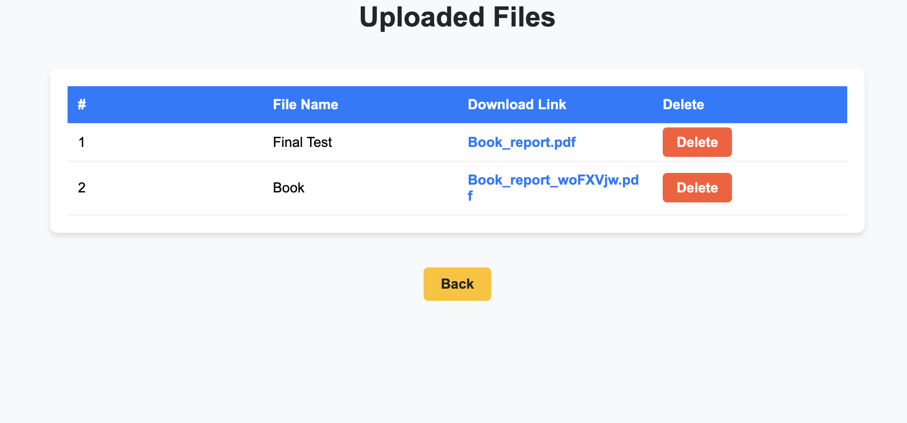
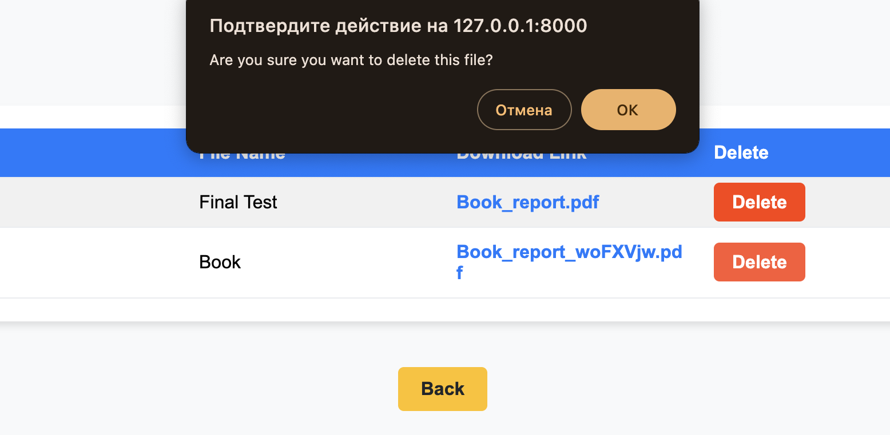
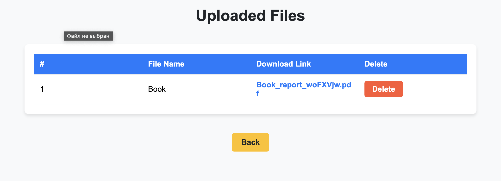
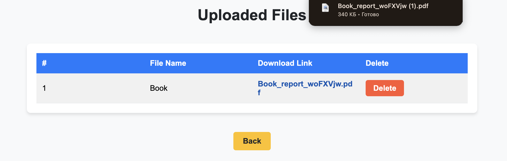

# File Upload System

A powerful and user-friendly Django-based web application designed to simplify the process of uploading, managing, and viewing files. The application provides an intuitive interface where users can upload files with descriptive names, browse through all uploaded files in a responsive table, and delete unnecessary files with ease.  

The File Upload System is ideal for personal and small team use cases, offering a simple solution for organizing and maintaining file collections without the need for complex setups or external dependencies.  

## Features

- Upload files with custom names.
- View all uploaded files in a responsive and styled table.
- Delete files directly from the list view.
- User-friendly interface with enhanced design and usability.

## Installation
1. Clone the repository:
   ```bash
   git clone https://github.com/your-username/FileUploadSystem.git
   cd FileUploadSystem
   ```
2. Create and activate a virtual environment:
   ```bash
   python -m venv env
   source env/bin/activate  # For macOS/Linux
   env\Scripts\activate     # For Windows
   ```
3. Install dependencies:
   ```bash
   pip install -r requirements.txt
   ```
4. Apply migrations:
   ```bash
   python manage.py makemigrations
   python manage.py migrate
   ```
5. Start the development server:
   ```bash
   python manage.py runserver
   ```
6. Access the application at `http://127.0.0.1:8000/`.

## File Structure
- **`urls.py`**: Routes the application's endpoints.
- **`index.html`**: The main upload page with form functionality.
- **`list.html`**: Displays all uploaded files in a styled table.

## Usage
1. Navigate to the homepage.
2. Upload files using the form and assign a name.
3. View all uploaded files by clicking on "Click" in the homepage.
4. Delete files as needed directly from the list.

## Screenshots










## Contributing
Contributions are welcome! Please follow these steps:
1. Fork the repository.
2. Create a new branch for your feature:
   ```bash
   git checkout -b feature-name
   ```
3. Commit your changes and push to your fork.
4. Open a pull request.

## License
This project is licensed under the MIT License.
